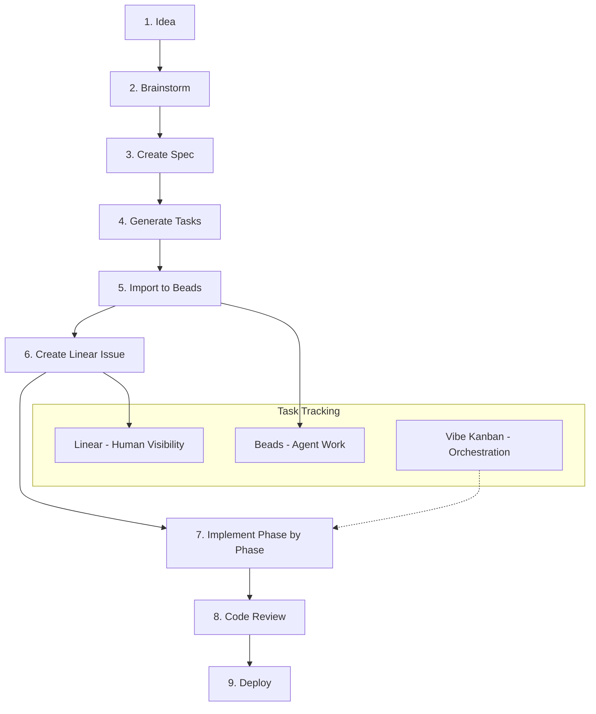

# Pentatonic Company Workflow Guide

This guide provides **exact step-by-step instructions** for building your logistics tracker from scratch using the Pentatonic workflow.

## When to Use Different Cursor Chats


| Chat Type                | When to Create      | Purpose                                            |
| ------------------------ | ------------------- | -------------------------------------------------- |
| **Main Orchestrator**    | Start of project    | Brainstorming, planning, specs, task generation    |
| **Implementation Chat**  | Start of each phase | Execute one phase of tasks                         |
| **VK Background Agents** | Parallel tasks      | Spin up via `/vk-start-agents` for concurrent work |
| **Review Chat**          | Before PR           | Dedicated code review session                      |


**Rule of thumb**: Start a **new chat** when switching to a different type of work. Keep the same chat for related work within a phase.

---

## Workflow Overview




---

## Step 1: Brainstorm Your Idea (You Are Here)

**Chat**: MAIN ORCHESTRATOR (this chat)  
**What to say**: Just describe your idea naturally

### Example Prompt

```
Let's brainstorm the logistics tracker. Here's what I'm thinking:

- Problem: We need to track shipments of returned items through our processing pipeline
- Users: Warehouse ops team and customer service
- Key entities: Shipments, Items, Locations, Carriers
- Must integrate with TES for event tracking
```

### What I'll Do

1. Ask clarifying questions one at a time
2. Explore approaches and tradeoffs
3. Create a design doc at `docs/brainstorms/YYYY-MM-DD-logistics-tracker-brainstorm.md`

**Output**: A design document capturing key decisions

---

## Step 2: Initialize Project and Beads

**Chat**: MAIN ORCHESTRATOR (same chat) or Terminal

### Commands to Run

```bash
# Initialize Beads in this project
bd init

# Or with custom prefix
bd init --prefix pluto
```

This creates `.beads/` directory for task tracking.

---

## Step 3: Create Specification Documents

**Chat**: MAIN ORCHESTRATOR (same chat)  
**What to say**: Ask me to create specs

### Directory Structure to Create

```
specs/
├── 001-logistics-tracker/
│   ├── plan.md          # Tech stack, architecture, file structure
│   ├── spec.md          # User stories with priorities (P1, P2, P3)
│   ├── data-model.md    # Entities and relationships
│   ├── contracts/       # API endpoint definitions
│   └── research.md      # Technical decisions
```

### Example Prompt

```
Create the specification documents for the logistics tracker based on our brainstorm.
Include:
- plan.md with Cloudflare Workers stack
- spec.md with user stories
- data-model.md for Shipment, Item, Location entities
```

---

## Step 4: Generate Tasks from Spec (SpecKit)

**Chat**: MAIN ORCHESTRATOR (same chat)  
**Skill invoked**: SpecKit (automatic)

### Prompt

```
/speckit.tasks

Generate tasks for specs/001-logistics-tracker/
```

### What Happens

1. Reads your spec documents (plan.md, spec.md, data-model.md)
2. Generates `tasks.md` with:
  - Phase 1: Setup (project initialization)
  - Phase 2: Foundational (blocking prerequisites)
  - Phase 3+: One phase per user story
  - Final Phase: Polish
3. Each task has: ID, priority, file paths, dependencies

---

## Step 5: Import Tasks to Beads

**Chat**: MAIN ORCHESTRATOR (same chat) or Terminal

After task generation, you'll be prompted:

```
"Would you like me to import these tasks into Beads for tracking?"
```

Say **yes**, or manually run:

```bash
# Import tasks to Beads
./scripts/speckit-to-beads.sh specs/001-logistics-tracker/tasks.md

# View ready tasks
bd ready -l 001-logistics-tracker
```

### Key Beads Commands


| Command                        | Purpose                               |
| ------------------------------ | ------------------------------------- |
| `bd ready`                     | Show unblocked tasks ready to work on |
| `bd list -l <spec>`            | List all tasks for a spec             |
| `bd show <id>`                 | Show task details                     |
| `bd close <id> --reason "..."` | Mark task complete                    |
| `bd status`                    | Overview of all tasks                 |


---

## Step 6: Create Linear Issue for Stakeholder Visibility

**Chat**: MAIN ORCHESTRATOR (same chat)

After Beads import, you'll be prompted:

```
"Would you like me to create a Linear issue to track this feature?"
```

Say **yes**, and I'll use the Linear MCP to create:

```markdown
Title: [In Progress] 001: Logistics Tracker

## Summary
<Overview from spec>

## Scope
- Phase count: 5
- Task count: 24
- MVP: User Story 1 (Track shipment status)

## Spec Reference
specs/001-logistics-tracker/
```

---

## Step 7: Implement Phase by Phase

**Chat**: NEW IMPLEMENTATION CHAT (start fresh for each phase)  
**Skill invoked**: SpecKit implement (automatic)

### Why a New Chat?

- Implementation chats get long and context-heavy
- Fresh chat = faster responses, focused context
- One chat per phase keeps work organized
- Easy to resume or reference later

### Prompt to Start Implementation (in new chat)

```
/speckit.implement

Start implementing Phase 1 (Setup) for specs/001-logistics-tracker/
```

Then for subsequent phases, start another new chat:

```
/speckit.implement

Continue with Phase 2 (Foundational) for specs/001-logistics-tracker/
```

### What Happens Per Task

1. I execute the task following Pentatonic patterns
2. Mark the task complete in `tasks.md`
3. Close the Beads task: `bd close <id> --reason "Completed"`
4. After each **phase** (not task), post update to Linear

### Vibe Kanban Integration (Parallel Agents)

**Chat**: VK BACKGROUND AGENTS (spawned automatically)

If Vibe Kanban is running, you can spin up multiple agents working in parallel:

```
/vk-start-agents
```

This starts background Claude Code agents on queued tasks. Each runs in its own context. Use when:

- Multiple tasks can run in parallel (marked [P] in tasks.md)
- You want faster completion
- Tasks don't depend on each other

---

## Step 8: Code Patterns to Follow (CRITICAL)

### Pattern 1: TES Events

**Rule**: If it didn't emit a TES event, it didn't happen.

```javascript
// Every meaningful action emits an event
await emitTESEvent({
  type: "shipment.created",
  correlation_id: context.correlationId,  // REQUIRED
  entity_type: "shipment",
  entity_id: generateCanonicalId("shipment"),  // ptc_ship_xxx
  payload: { origin, destination, items },
}, env, context);
```

### Pattern 2: Canonical IDs


| Entity   | Format            |
| -------- | ----------------- |
| Shipment | `ptc_ship_{uuid}` |
| Item     | `ptc_item_{uuid}` |
| Location | `ptc_loc_{uuid}`  |
| Carrier  | `ptc_carr_{uuid}` |
| Event    | `ptc_evt_{uuid}`  |


### Pattern 3: Schema Validation

```javascript
import { z } from "zod";

export const ShipmentSchema = z.object({
  identity: z.object({
    canonical_id: z.string().startsWith("ptc_ship_"),
  }),
  schema_version: z.literal("v1"),
  // ... fields
});

// Validate at runtime
const result = ShipmentSchema.safeParse(input);
```

### Pattern 4: Projections (Not D1 Directly)

```javascript
// CORRECT: Query projection for current state
const state = await getProjection(env, "ptc_ship_abc123");

// WRONG: Query D1 directly for "truth"
// const result = await env.DB.prepare("SELECT * FROM shipments").first();
```

---

## Step 9: Track Your Work Session

**Chat**: ANY CHAT (wherever you're working)

### Start Tracking

```
/track
```

Creates a Linear issue tracking your session with:

- What you're working on
- Progress updates
- Files changed

### End Session

```
/track done
```

Adds completion summary to Linear issue.

Use `/track` at the start of any significant work session, regardless of which chat you're in.

---

## Step 10: Code Review Before Merge

**Chat**: NEW REVIEW CHAT (dedicated to review)  
**Skill invoked**: code-review

### Why a New Chat?

- Review needs fresh context to see changes objectively
- Keeps review findings separate from implementation discussion
- Easy to reference later for PR description

### Prompt

```
Review the changes for the logistics tracker before I create a PR
```

### What Gets Checked

1. **Linting**: `npm run lint`
2. **Type checking**: `npm run typecheck`
3. **Tests**: `npm test`
4. **Security**: Hardcoded secrets, SQL injection, XSS
5. **Pentatonic patterns**: TES events, canonical IDs, schema validation

---

## Step 11: Deploy

**Chat**: REVIEW CHAT (continue from review) or Terminal  
**Skill invoked**: full-deploy

### Prompt for Full Pipeline

```
Deploy the logistics tracker to production
```

### What Happens

1. Run tests
2. Security audit
3. Build workers
4. Apply D1 migrations
5. Deploy to Cloudflare
6. Verify deployment

### Manual Commands

```bash
# D1 migrations
npx wrangler d1 migrations apply pluto-logistics-db --remote

# Deploy worker
npx wrangler deploy

# Tail logs to verify
timeout 15 npx wrangler tail
```

---

## Quick Reference: What to Say When


| Situation            | Chat to Use             | What to Prompt                    |
| -------------------- | ----------------------- | --------------------------------- |
| Start new feature    | MAIN ORCHESTRATOR       | "Let's brainstorm [feature name]" |
| Create specs         | MAIN ORCHESTRATOR       | "Create spec docs for..."         |
| Generate tasks       | MAIN ORCHESTRATOR       | `/speckit.tasks`                  |
| Start implementation | NEW IMPLEMENTATION CHAT | `/speckit.implement Phase N...`   |
| See ready tasks      | Terminal                | `bd ready`                        |
| Mark task done       | Terminal                | `bd close <id> --reason "..."`    |
| Track your session   | ANY CHAT                | `/track`                          |
| End work session     | ANY CHAT                | `/track done`                     |
| Start VK agents      | ANY CHAT                | `/vk-start-agents`                |
| Code review          | NEW REVIEW CHAT         | "Review changes before PR"        |
| Deploy               | REVIEW CHAT or Terminal | "Deploy to production"            |


---

## Chat Lifecycle Summary

```
MAIN ORCHESTRATOR CHAT (this chat)
├── Brainstorm idea
├── Create spec docs
├── Generate tasks (/speckit.tasks)
├── Import to Beads
└── Create Linear issue
    │
    ├──> NEW: IMPLEMENTATION CHAT (Phase 1)
    │    └── /speckit.implement Phase 1...
    │
    ├──> NEW: IMPLEMENTATION CHAT (Phase 2)
    │    └── /speckit.implement Phase 2...
    │
    ├──> VK BACKGROUND AGENTS (parallel tasks)
    │    └── /vk-start-agents (spawns automatically)
    │
    └──> NEW: REVIEW CHAT
         ├── "Review changes before PR"
         └── "Deploy to production"
```

---

## Skills That Auto-Activate

These skills are invoked automatically based on what you're doing:


| Skill                       | When It Activates               |
| --------------------------- | ------------------------------- |
| `pentatonic-best-practices` | Writing any Pentatonic code     |
| `tes-events`                | Emitting or handling TES events |
| `canonical-ids`             | Creating entity IDs             |
| `schema-validators`         | Defining or validating schemas  |
| `projections`               | Building current state views    |
| `frontend-design`           | Building UI components          |


---

## Tech Stack Reference


| Layer             | Technology                  |
| ----------------- | --------------------------- |
| **Runtime**       | Cloudflare Workers          |
| **Database**      | Cloudflare D1 (SQLite)      |
| **Vector Search** | Milvus on DGX Spark         |
| **AI Services**   | DGX Ollama, Vision, Pricing |
| **Events**        | TES (Takeback Event System) |
| **Auth**          | OAuth 2.0 via TES           |


---

## AI Services Available


| Service        | Endpoint                      | Use Case        |
| -------------- | ----------------------------- | --------------- |
| **Ollama**     | dgx-ollama.pentatonic.com     | LLM inference   |
| **Vision**     | dgx-vision.pentatonic.com     | Image analysis  |
| **Milvus**     | dgx-milvus.pentatonic.com     | Vector search   |
| **Embeddings** | dgx-embeddings.pentatonic.com | Text embeddings |
| **Pricing**    | dgx-pricing.pentatonic.com    | Dynamic pricing |


---

## Anti-Patterns to Avoid

- Missing `correlation_id` on TES events
- Using auto-increment IDs instead of canonical IDs
- Mutating state without emitting an event
- No schema validation on API inputs
- Using `process.env` instead of `env.VAR` in Workers
- Querying D1 directly for "current truth" instead of projections
- Not closing Beads tasks after completion

---

## Ready to Start?

Tell me about your logistics tracker idea. What problem does it solve? What entities does it track? Who uses it?